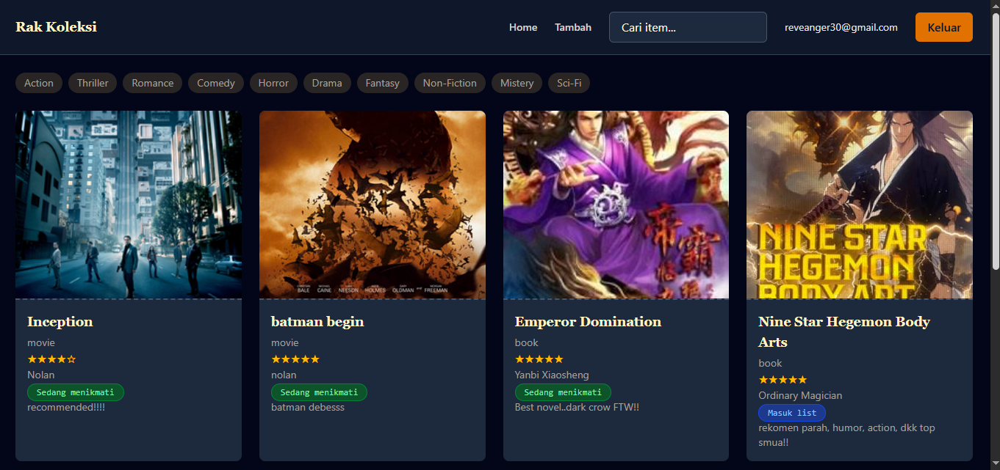
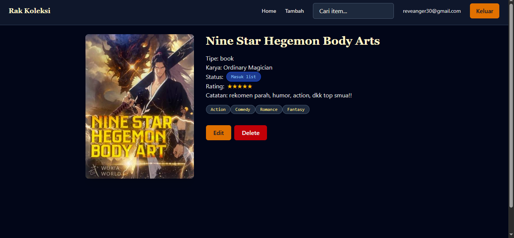
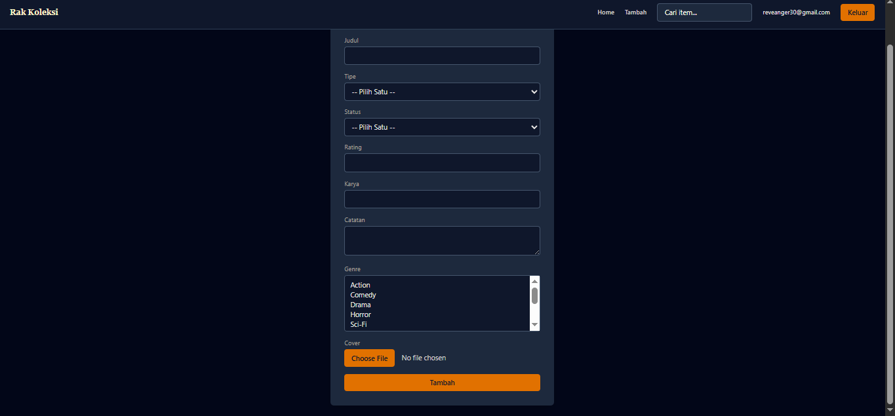

# 📚 Rak Koleksi — Movie & Book Tracker

Aplikasi web buat nyatet dan ngelacak koleksi film dan buku pribadi — mau lagi ditonton/dibaca, masuk wishlist, atau udah selesai dinikmati. Dibangun sebagai portfolio project buat belajar React, Supabase, dan pola-pola umum di aplikasi CRUD modern.

## ✨ Fitur

- **Autentikasi user** — login & register, tiap user punya koleksi masing-masing
- **CRUD item** — tambah, edit, hapus film/buku lengkap dengan cover, rating, catatan
- **Multi-genre per item** — relasi many-to-many, 1 item bisa punya beberapa genre sekaligus
- **Filter & search real-time** — cari judul, filter by genre, filter by status — semuanya lewat URL query params (bisa di-share/bookmark)
- **Navigasi saling terhubung** — klik status atau genre di kartu/detail item langsung nge-filter Dashboard
- **Upload cover image** — tersimpan di Supabase Storage
- **Animasi transisi halaman** — pakai Framer Motion
- **Skeleton loading & empty states** — UX yang konsisten di semua kondisi (loading, kosong, error, 404)

## 🛠️ Tech Stack

- **React** (Vite) — UI library
- **React Router v7** — routing & navigasi, termasuk `useSearchParams` buat filter state
- **Supabase** — database (PostgreSQL), autentikasi, dan storage buat cover image
- **Tailwind CSS v4** — styling
- **Framer Motion** — animasi transisi halaman

## 📸 Screenshot

### Dashboard


### Detail Item


### Form Tambah/Edit Item


## 🗄️ Struktur Database

Tabel utama di Supabase:

- `items` — data film/buku (title, type, rating, status, cover_url, dll)
- `genres` — daftar master genre (Action, Drama, Sci-Fi, dll)
- `item_genres` — tabel penghubung (many-to-many antara items dan genres)

## 🚀 Menjalankan Secara Lokal

1. Clone repo ini
   ```bash
   git clone https://github.com/username-kamu/nama-repo.git
   cd nama-repo
   ```

2. Install dependencies
   ```bash
   npm install
   ```

3. Bikin file `.env` di root project, isi dengan kredensial Supabase kamu:
   ```
   VITE_SUPABASE_URL=your-supabase-url
   VITE_SUPABASE_ANON_KEY=your-supabase-anon-key
   ```

4. Jalankan development server
   ```bash
   npm run dev
   ```

5. Buka `http://localhost:5173`

## 📝 Catatan

Project ini dibangun sebagai bagian dari proses belajar — beberapa keputusan desain (misal filter state di URL, custom hook `useSupabaseQuery`) sengaja dipilih buat latihan pola-pola yang umum dipakai di aplikasi React production.

## 📄 Lisensi

MIT
